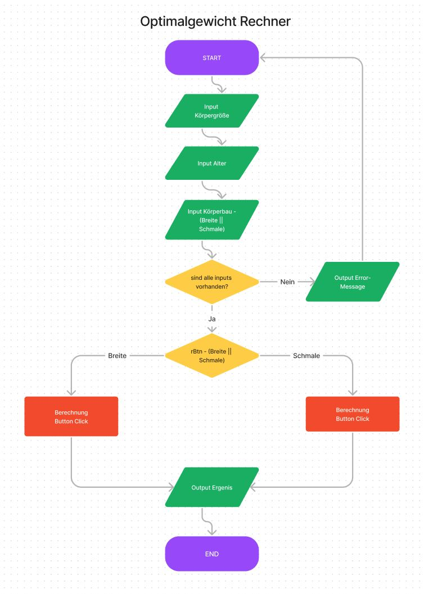

# Multiple Calculator – JavaScript-Projekt

## Beschreibung

Die nachfolgenden JavaScript-Einzelprojekte wurden im Rahmen eines Coding-Bootcamps bei supercode.de erstellt und im Anschluss zu einem multiple calculator zusammengefügt und weiterentwickelt. Es handelt sich u. a. um einen Idealgewichts-Rechner, der es ermöglicht, das Optimalgewicht, abhängig vom jeweiligen Körperbau des Users, zu berechen. Des Weiteren um einen Kalorien-Rechner, der es ermöglicht, den Grundumsatz und den Gesamtumsatz von Frauen und Männern berechnen zu können und zu guter Letzt um einen Mehrwertsteuer-Rechner, der es ermöglicht, die Mehrwertsteuer für verschiedene Mehrwertsteuersätze (19% und 7%) berechnen zu können. Mithilfe eines benutzerfreundlichen Formulars können Nutzer entweder einen Nettobetrag (Preis ohne Mehrwertsteuer) oder einen Bruttobetrag (Preis inklusive Mehrwertsteuer) in Euro eingeben.

## Tools/Technologien

- HTML5
- CSS3
- Vanilla JavaScript

***

## Idealgewichts-Rechner

### Der Idealgewichts-Rechner bietet die Möglichkeit folgende Berechnungen durchzuführen

- Idealgewicht für einen breiten Körperbau
- Idealgewicht für einen zierlichen und schmalen Körperbau

### Das Idealgewicht wird anhand folgender Formeln berechnet

- Formel für Menschen mit einem zierlichen und schmalen Körperbau:
[(Körpergröße in cm - 100) + (Alter/ 10)] x 0,9 x 0,9

- Formel für Menschen mit einem eher breiten Körperbau:
[(Körpergröße in cm - 100) + (Alter/ 10)] x 0,9 x 1,1

## Funktionsweise Idealgewichts-Rechner

1. Gib deine Körpergröße in cm an.
2. Gib dein Alter in Jahren an.
3. Wähle aus, ob du einen breiten oder schmalen Körperbau hast.
4. Klicke auf den Berechnen-Button, um die Ergebnisse anzeigen zu lassen.

## Screenshots

### PAP - Flowchart für den Idealgewichtsrechner

### Idealgewicht-Berechnung einer Person mit schmalerem Körperbau

***

## Kalorien-Rechner

### Der Kalorien-Rechner bietet die Möglichkeit folgende Berechnungen durchzuführen

- Grundumsatz in Kilokalorien (kcal) und Kilojoule (kJ)
- Gesamtumsatz in Kilokalorien (kcal) und Kilojoule (kJ)

### Der Grundumsatz wird anhand der Harris Benedict Formel berechnet

- Grundumsatz bei Männern: (Kalorien je Tag) 66.47 + (13.7 x Körpergewicht in kg) + (5 x Körpergröße in cm) – (6.8 x Alter in Jahren) = Grundumsatz
- Grundumsatz bei Frauen: (Kalorien je Tag) 655.1 + (9.6 x Körpergewicht in kg) + (1.8 x Körpergröße in cm) – (4.7 x Alter in Jahren) = Grundumsatz

Der Gesamtumsatz wird über den PAL-Faktor (PAL = Physical Activity Level) berechnet, indem man den Grundumsatz mit dem entsprechenden PAL-Faktor multipliziert.

## Funktionsweise Kalorien-Rechner

1. Gib deine Körpergröße in cm an.
2. Gib dein Alter in Jahren an.
3. Gib dein Gewicht in kg an.
4. Wähle aus, ob du weiblich oder männlich ist.
5. Gib deine tägliche körperliche Belastung an.
6. Klicke auf den Berechnen-Button, um die Ergebnisse anzeigen zu lassen.

## Screenshots Kalorien-Rechner

### Berechnung des Grund- und Gesamtumsatzes beim Mann

***

## Mehrwertsteuer-Rechner

### Der Mehrwertsteuer-Rechner bietet die Möglichkeit folgende Berechnungen durchzuführen

- Mehrwertsteuer aufschlagen (Netto zu Brutto)
- Mehrwertsteuer abziehen (Brutto zu Netto)

Durch die Auswahl einer der beiden Radio-Buttons ändert sich der Labeltext des Number-Inputfeldes entsprechend.

## Funktionsweise Mehrwertsteuer-Rechner

1. Wähle aus, ob du die Mehrwertsteuer aufschlagen oder abziehen möchtest.
2. Gib den Betrag in das Number-Inputfeld ein, entweder als Nettobetrag oder Bruttobetrag, abhängig von deiner vorherigen Auswahl.
3. Wähle den gewünschten Mehrwertsteuersatz (19% oder 7%) mithilfe der Radio-Buttons.
4. Klicke auf den "Berechnen"-Button, um die Berechnung durchzuführen.
5. Die Anwendung zeigt den Mehrwertsteuerbetrag in Euro sowie den Bruttobetrag (Endpreis) oder den Nettobetrag an, je nachdem, welchen Radio-Button du oben ausgewählt hast.

## Screenshots Mehrwertsteuer-Rechner

### Berechnung Mehrwertsteuer abziehen

### Berechnung Mehrwertsteuer aufschlagen

***

## GitHub Live Vorschau

Du findest eine Live Vorschau auf GitHub: [GitHub Live Vorschau](https://w1tch3r-code.github.io/js_multiple_calculator/)

## GitHub Repository

Du findest das gesamte Projekt auf GitHub: [GitHub Repository](https://github.com/w1tch3r-code/js_multiple_calculator)

## Anmerkungen

- Die Einzel-Projekte wurden im Rahmen eines Coding-Bootcamps bei supercode.de erstellt und im Anschluss weiterentwickelt.
- Die Anwendung ermöglicht eine einfache und schnelle Berechnung des Idealgewichts, des Grund- und Gesamtumsatzes von Frauen und Männern und der Mehrwertsteuer für verschiedene Mehrwertsteuersätze.
- Die README.md-Datei dient auch als Bewerbungsunterlage und präsentiert meine Fähigkeiten in der Webentwicklung.
